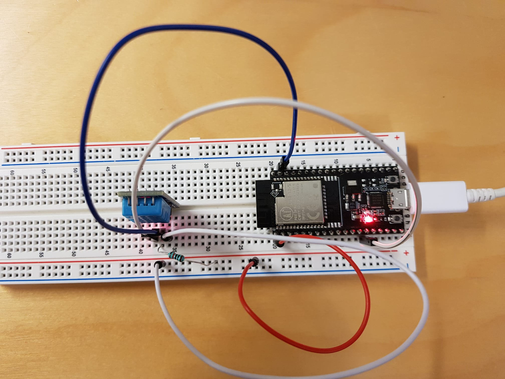
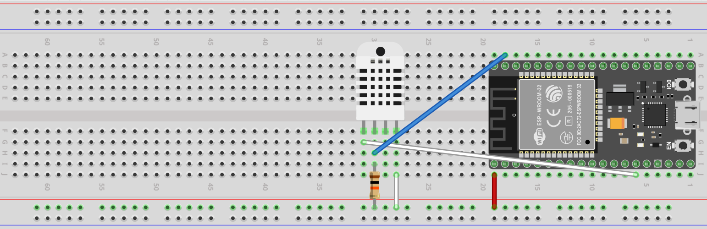
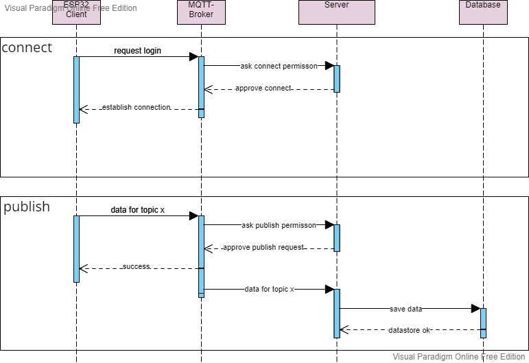
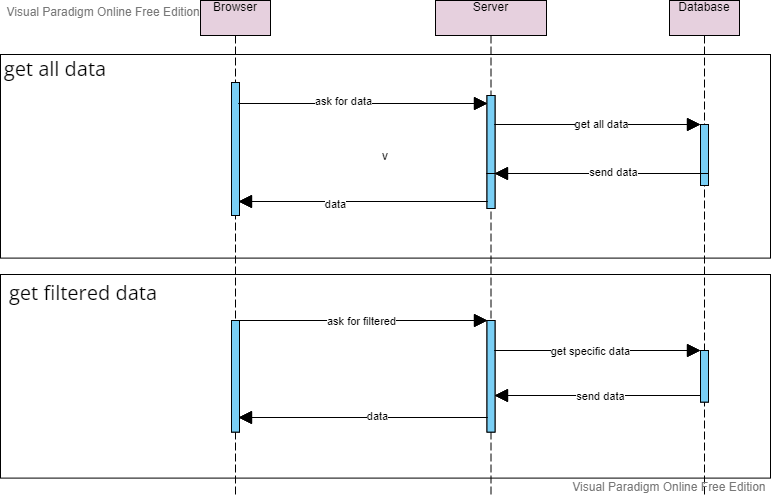
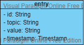

# IoTProcessor
This project is a school project for a finnish school on my exchange term.

Access the API documentation with the following path: /swagger-ui/index.html

## Enviroment variables
| Variable | Meaning |
| --- | --- |
| `DATABASE_URL` | Connection to Database |
| `STACKHERO_MOSQUITTO_HOST`  | Hostname of MQTT broker |
|`STACKHERO_MOSQUITTO_URL_CLEAR` | The url of the MQTT broker (unsecure)|
|`STACKHERO_MOSQUITTO_URL_TLS` | The url of the MQTT broker (secure)|
|`STACKHERO_MOSQUITTO_USER_LOGIN`| Username to MQTT Broker |
|`STACKHERO_MOSQUITTO_USER_PASSWORD`|  Password to MQTT Broker |

## Big Picture

## Connect the client
We connected out client with the sensor on an breadboard. On this picture we used a ESP32 microcontroller (NodeMCU-32S ESP32), a DHT11 sensor and a 10k Ohm resistor:

## Sequence Diagram
The connection between client and server uses a mqtt broker from stackhero. This broker provides the function that the broker needs to ask our api for permission before every action. On the basis of a stackhero [documentation](https://www.stackhero.io/en/services/Mosquitto/documentations/Authentication-of-devices#authenticate-mqtt-users-using-an-api) we implemented routes to enable the broker to communicate with our api. On this picture you can see how it works:

Here you can see how the connection between the client, our server and database is working.
We can also request data from the server. There are two implemented ways to request data: all data or filtered data.
The filter is applied to the database and not on the server. You can see on this diagram how it works:

## Database
We use a postgres database to store data. This database is connected with hibernate and we don't have to do manual database queries. This is our scheme:

## Notice
Don't use this project for production. There is no server based login and you should protect your data.
This project is not maintained and it is possible that this is a danger for your enviroment. 
